# Feladatok beadása (GitHub)

Minden feladat beadásához a **GitHub** platformot használjuk. Minden labor beadása egy-egy GitHub repository-ban történik, melyet a Moodle-ben található linken keresztül fogtok megkapni. A feladatok megoldását ezen repository-ban kell majd elkészíteni, és ide kell feltölteni. A kész megoldás beadása a repository-ba való feltöltés után egy un. **pull request** formájában történik, amelyet mindig az adott laborvezetőhöz kell rendelnetek.

!!! warning "Fontos"
    Az itt leírt formai előírások betartása elvárás. A nem ilyen formában beadott megoldásokat nem értékeljük.

## Rövidített verzió

Alább részletesen bemutatjuk a beadás menetét. Itt egy rövid összefoglaló az áttekintéshez, illetve a helyes beadás ellenőrzéséhez.

1. A munkádat Moodle-ben található Classroom meghívó linken keresztül létrehozott GitHub repository-ban kell elkészítsd.

2. A megoldáshoz készíts egy külön ágat, ne a _master_-en dolgozz. Erre az ágra akárhány kommitot tehetsz. Mindenképpen pushold a megoldást.

3. A beadást egy pull request jelzi, amely pull request-et a laborvezetődhöz kell rendelned.

4. Ha az eredménnyel vagy értékeléssel kapcsolatban kérdésed van, pull request kommentben kérdezhetsz. A laborvezető értesítéséhez használd a `@név` címzést a komment szövegében.

## Előkészületek

Első lépésként, ha még nem lenne accountod, [regisztrálj](https://github.com/join) egy GitHub felhasználót.

## Repository létrehozása

Minden laboron az aktuális feladathoz egy meghívó URL lesz a Moodle-ben. A meghívás elfogadásával létre fog jönni a saját repositoryd amiben a megoldásokat kell elkészíteni. Az URL minden laborhoz más lesz.

1. Keressük meg a Moodle kurzus oldalán a laborhoz tartozó **meghívó URL-t**, és nyissuk meg.

2. Ha kéri, jelentkezzünk be az eduID azonosítónkkal.
    <figure markdown>
      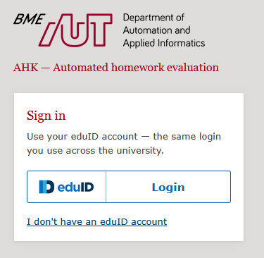
    </figure>

3. Látni fogunk egy oldalt, ahol elfogadhatjuk a feladatot (`Accept this assignment`). Kattintsunk a gombra.
    <figure markdown>
      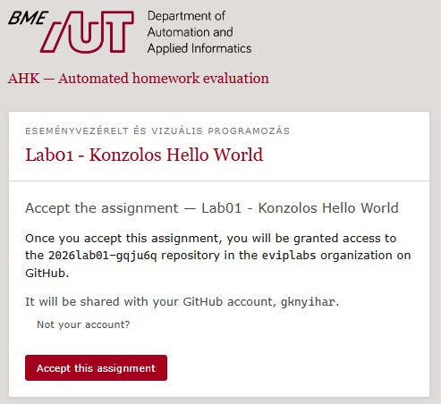
    </figure>

4. Várjuk meg, amíg elkészül a repository. A repository linkjét itt fogjuk megkapni.
    <figure markdown>
      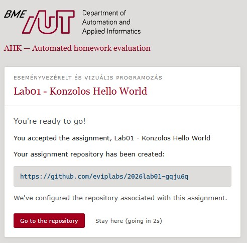
    </figure>

5. Nyissuk meg a repository-t a webes felületen a linkre kattintva (vagy várjuk meg, míg automatikusan továbbirányít minket).
    <figure markdown>
      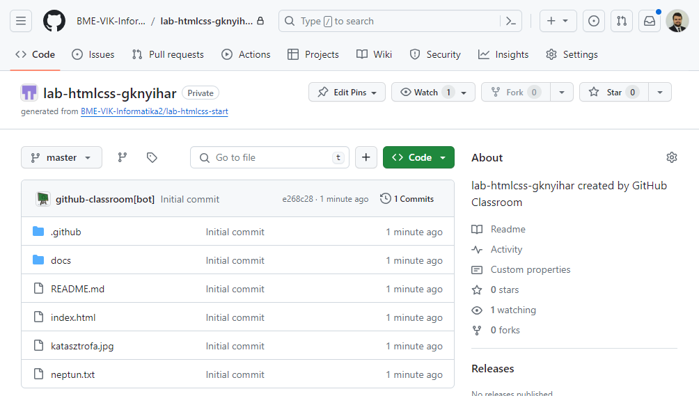
    </figure>

!!! note "Megjegyzés"
    A repository privát, vagyis csak te és az oktatók látják a tartalmát.

## Repository letöltése

Annak érdekében, hogy a repository-n dolgozni tudjuk, szükségünk van egy lokális verzióra, amit klónozással fogunk létrehozni. A git alapvetően egy parancssoros alkalmazás, vagyis minden műveletet a parancssorba gépelt utasításokkal tudunk végrehajtani. Viszont annak érdekében, hogy ne kelljen különböző utasításokat ismerni, számos vizuális git kliens program készült már. Ha már van kedvencünk, akkor nyugodtan használjuk azt, mivel bármelyikkel el tudjuk végezni a feladatot. Ha még nem ismerünk ilyet, akkor kövessük az alábbi útmutatót, ahol a Git Extensions programot mutatjuk be. Minden egyes lépéshez kiírjuk a parancssoros megfelelőjét is az utasításnak.

!!! info "Kliens"
    Szükségünk lesz a [Git](https://git-scm.com/download/win) valamint a [Git Extensions](https://gitextensions.github.io/) szoftverre telepítve a gépünkre.

1. Másoljuk ki a repository linkjét.

    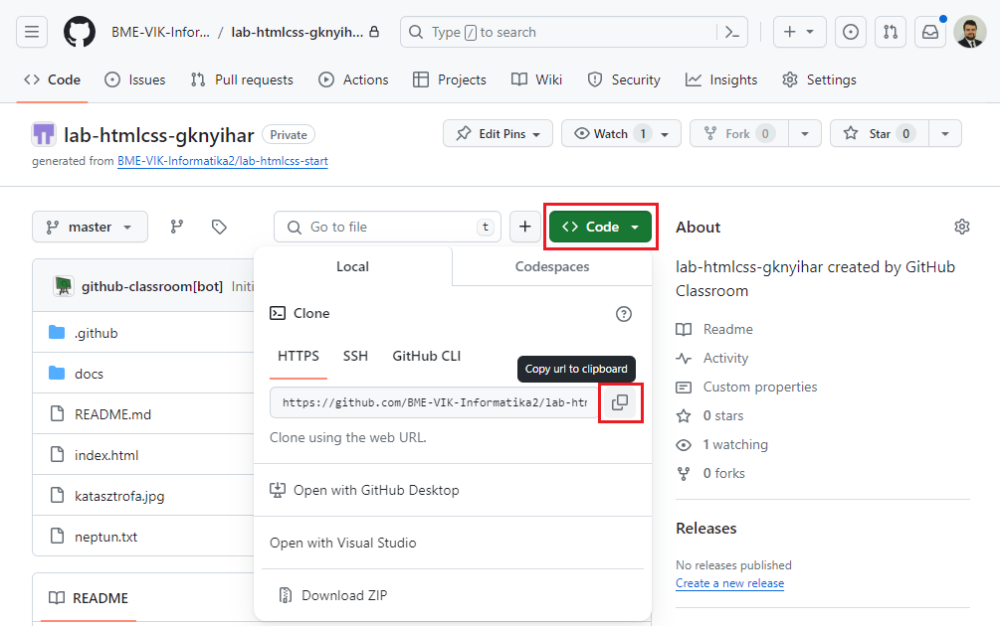

1. Nyissuk meg a Git Extensions programot.

1. Első használatkor, vagy a labor kezdetén állítsuk be a nevünket és az email címünket:
    - Válasszuk a `Tools` > `Settings` menüt.
    - Navigáljunk el a `Git` > `Config` almenübe a bal oldalon található fában.
    - Adjuk meg a nevünket és az email címünket, amivel regisztráltunk a GitHub-ra.

    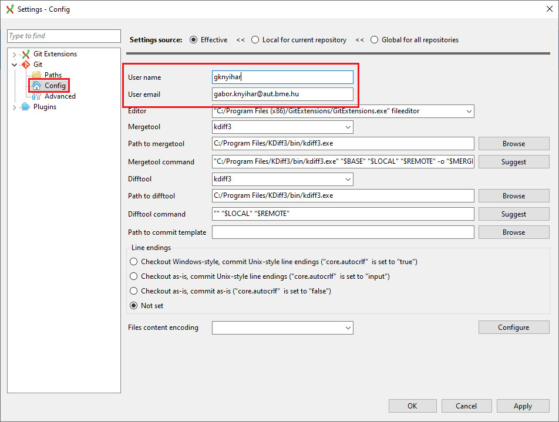

    **Parancssorban**

    ```bash
    git config user.name "nev"
    git config user.email "nev@email.hu"
    ```

    Érdemes a global kapcsolót használni, ekkor nem kell minden alkalommal megcsinálni.

    ```bash
    git config --global user.name "nev"
    git config --global user.email "nev@email.hu"
    ```

1. Klónozzuk le a repositoryt.
    - Válasszuk a ˙Clone repository` opciót.
    - A `Repository to clone`-hoz adjuk meg a linket amit kimásoltunk.
    - A `Destination`-nek adjuk meg, hol szeretnénk létrehozni a lokális másolatot.
    - Menjünk a `Clone` gombra, majd `OK` és `Igen`

    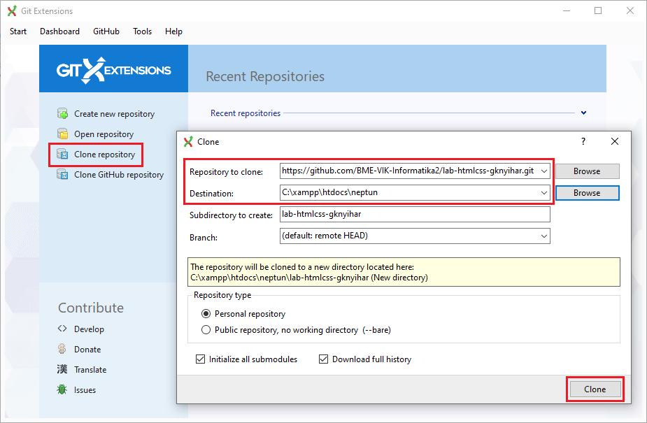

    - Abban az esetben, ha authentikációt kér a program, válasszuk a böngészős megoldást, vagy adjuk meg a felhasználónevünket és egy **personal access token**-t.

    !!! warning "Personal Access Token"
        2021 óta a GitHub nem fogad el jelszót az egyes műveletek authentikálásához, emiatt szükségünk lesz egy **Personal Access Token**-re, és mindenhol ezt kell majd használnuk a jelszó helyett.

        Tokent a következő módon lehet generálni:

        - Látogassunk el a [https://github.com/settings/tokens](https://github.com/settings/tokens) oldalra.
        - Válasszuk a `Generate new token` > `Generate new token (classic)` opciót.
        - Adjunk meg egy leírást a `Note` mezőbe.
        - Adjuk meg, hogy mikor járjon le a token az `Expiration` mezőbe. Választhatunk hosszú időtartamot, mivel a kliens meg fogja jegyezni.
        - A `Scope`-nál pipáljuk be a `repo`-t.
        
        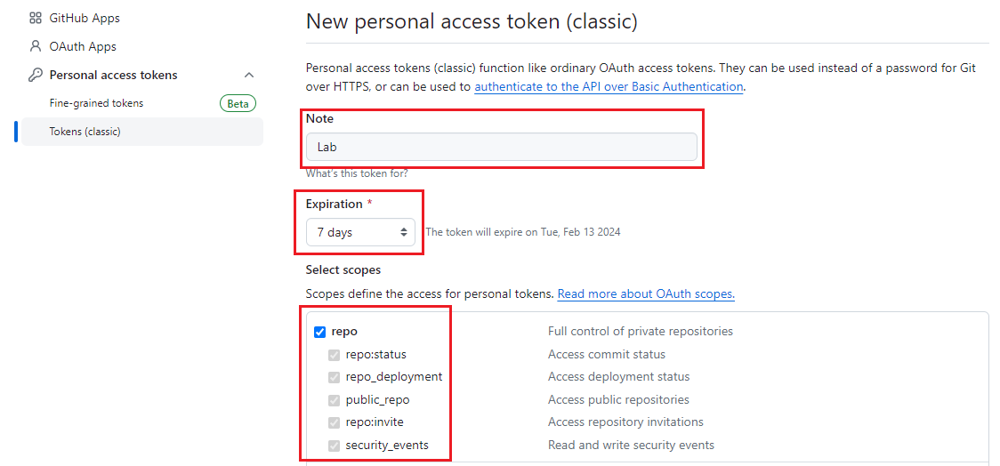
        
        - Menjünk a `Generate token` gombra a lap alján.
        - **Másoljuk ki** a kapott tokent és **mentsük el** valahova, mert többet nem lesz lehetőségünk megnézni.
        - Minden alkalommal, amikor a git kliens jelszót kér, a tokent kell megadni.

    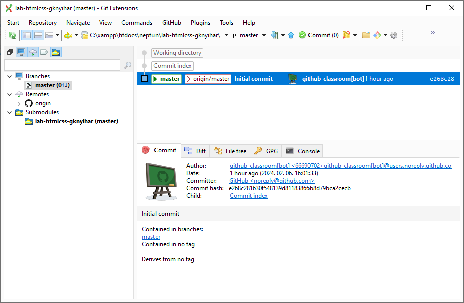

    **Parancssorban**

    ```bash
    cd <mappa, ahova szeretnék klónozni>
    git clone <repository url>
    ```

## Új branch létrehozása és Neptun kód megadása

Klónozás után a kiindulási kódunk a master branchen található, ahol még semmilyen nyoma nincs a labor megoldásnak. A beadás során a laborvezető mindig a te munkádra lesz kíváncsi, ezért a beadott megoldást mindig a kiindulási alappal fogja összehasonlítani és a változásokat értékelni. Ennek érdekében a kiindulási alapot meg kell tartanunk abban az állapotban, amiben van, vagyis a **master** branchre ne kommitolj **soha**! Helyette létrehozunk egy új ágat (branch) és azon fogunk dolgozni, majd pedig a pull requestet adunk be, ami pontosan ezt a két ágat fogja összehasonlítani.

!!! note "Figyelem"
    Abban az esetben ha ezt a branchet már korábban létrehoztad és csak folytatni szeretnéd a megkezdett munkád, akkor hagyd ki ezt a lépést és ugorj a [Váltás meglévő branchre](#valtas-meglevo-branchre) lépésre.

1. Hozzunk létre egy új branchet.
    - Válasszuk a `Commands` > `Create branch...` menüpontot.
    - Adjunk meg egy nevet az új branchnek. Bármilyen neved adhatunk, de az egységesség kedvéért legyen `megoldas`.
    - Figyeljünk rá, hogy a branch nevében ne legyen ékezet.
    - Menjünk a `Create branch` gombra, majd `OK`.

    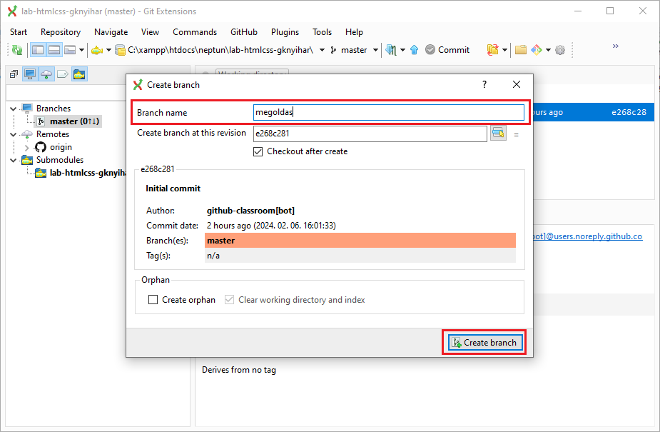

    **Parancssorban**

    ```bash
    git checkout -b <branch név>
    ```

1. Nyissuk meg a repositoryt és töltsük ki a `neptun.txt` fájlt.
    - A fájlt a repository gyökerében találjuk.
    - Ne írjunk semmi mást a fájlba, csakis a Neptun kódunk 6 karakterét csupa nagybetűvel (pl. ABC123).

1. Kommitoljuk a változtatást.
    - Ellenőrizzük, hogy a megfelelő branchen vagyunk, majd menjünk a `Commit` gombra. A szám a felirat mellett a változtatások számát jelenti.

    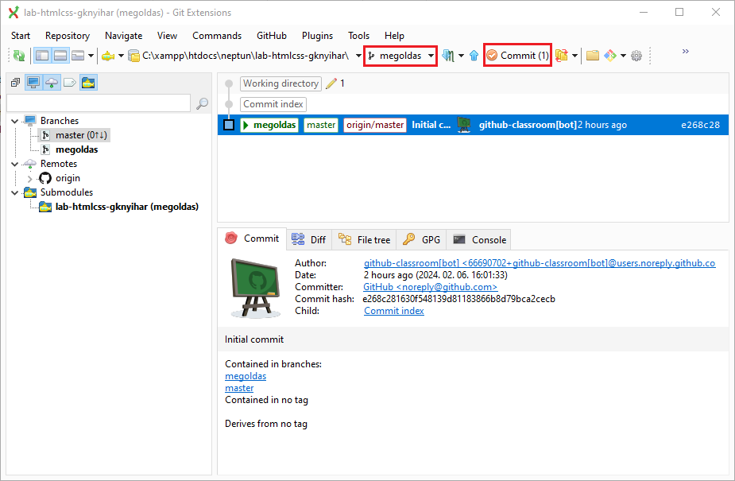

    - Válasszuk ki a változtatásokat, amiket szeretnénk menteni és vigyük le a `Stage` / `Stage all` gombokkal.
    - Adjunk meg egy üzenetet, hogy mit tartalmaz a commit.
    - Menjünk a `Commit` gombra, majd `OK`.

    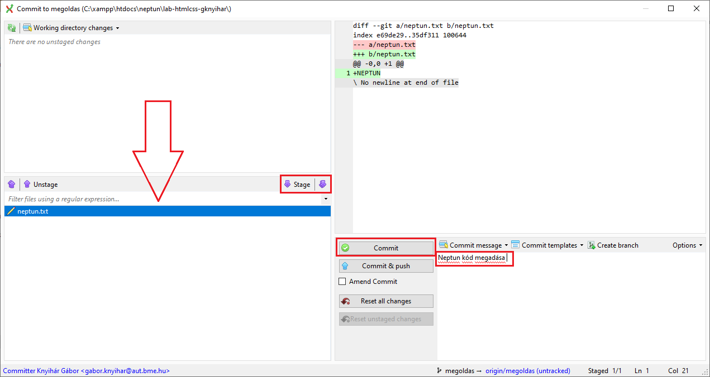

    **Parancssorban**

    ```bash
    git status # változások lekérése

    git add <fájlnév> # adott fájl stagelése
    git add -A # összes fájl stagelése

    git commit -m <commit üzenet> # stagelt változtatások kommitolása
    ```

## Váltás meglévő branchre

Előfordulhat olyan eset, hogy egy korábbi alkalommal már elkezdted a munkát, de nem sikerült befejezni, ezért most folytatni szeretnéd. Ebben az esetben nem kell újra létrehozni a `megoldas` branchet, hanem a meglévőt tudod folytatni. Ahhoz, hogy folytatni tudd, először ki kell választanod a megfelelő branchet.

1. Nyisd le a branch választó legördülő menüt és menj a `Checkout branch` opcióra.

    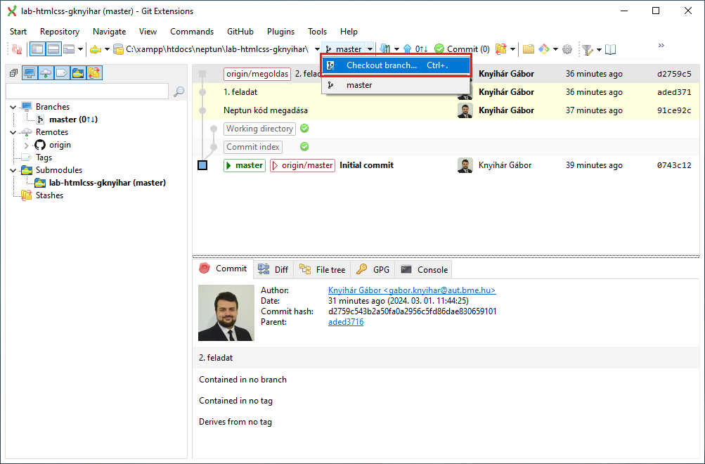

2. Menj a `Remote branch`-re, válaszd az `origin/megoldas` branchet, majd `Checkout` és `OK`.

    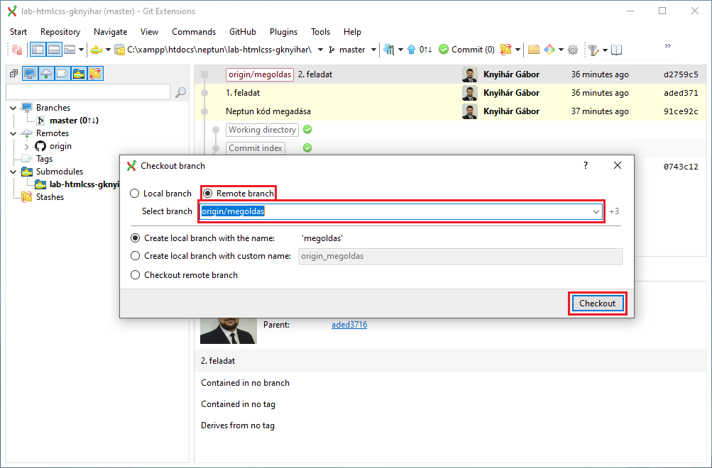

    **Parancssorban**

    ```bash
    git checkout <branch> 

    # például ebben az esetben:

    git checkout megoldas
    ```

## Megoldások elkészítése

Ezután következik a megoldások elkészítése. Ennek során figyelj a következőkre:

- A feladatokat a kiadott leírás illetve a laborvezető utasításai alapján készítsd el.
- Gyakran, de legalább akkor, amikor az útmutató kéri, kommitolj.
- Figyelj rá, hogy mindig jó branchen legyél, valamint hogy minden módosítást kommitolj.
- A beállítási fájlokat, fordítási eredményeket (pl.: `bin`, `obj`, `.user`) ne kommitolj.
- Commit üzenetnél nem számít, hogy magyarul vagy angolul írod, de mindig értelmes üzenetet adj meg ami tükrözi, hogy mit tartalmaz a változtatás.
- Amennyiben a feladat képernyőképet kér, azt mindig a megfelelő helyre, a megadott néven mentsd el.
- Szöveges válaszok esetén a kiadott leírás szövegébe, a megfelelő helyre kell írni a választ.

## Megoldások feltöltése

Miután végeztünk, de legkésőbb a labor végén, töltsük fel a megoldásokat a távoli GitHub repositoryba. Ezt a műveletet `push`-nak hívják.

1. Ellenőrizzük, hogy a megfelelő branchen állunk, illetve vannak-e lokális kommitok:
    - Azt, hogy a branchek melyik commitra mutatnak, a fában láthatjuk.
    - A lokális brancheket zöld színnel, a távoli brancheket bordó színnel láthatjuk.
    - A `megoldas` branch csak lokálisan létezik, mivel nincs sehol `origin/megoldas`.
    - Amennyiben a lokális és a távoli branch ugyanarra a commitra mutat, akkor a változtatások szinkronizálva vannak.

    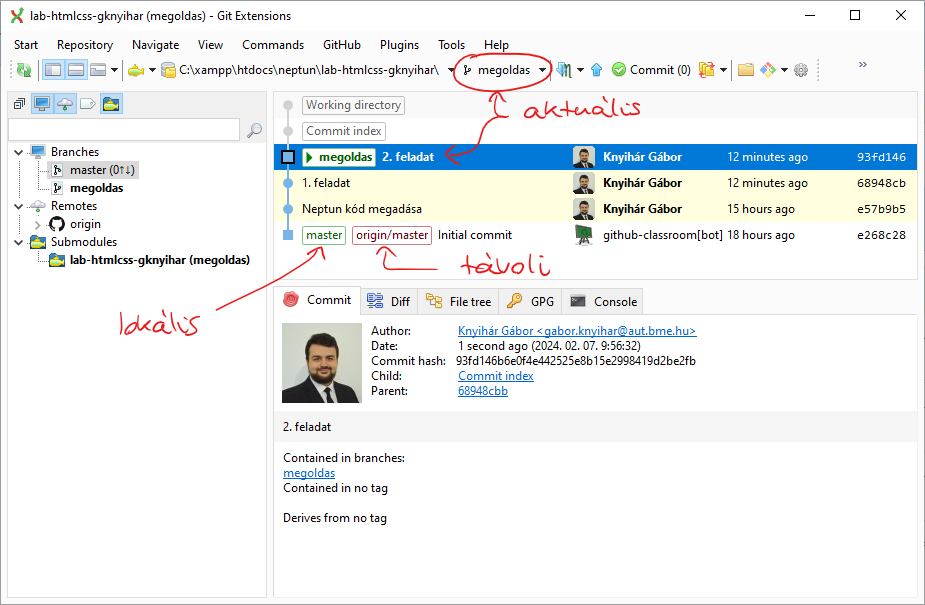

    **Parancssorban**

    ```bash
    git log
    ```

1. Menjünk a `Push` gombra, majd ismét `Push`, `Igen`, `Igen` és `OK`.
    - Ha autentikációt kér, használjuk a korábbi lépésben elkészített tokent.

    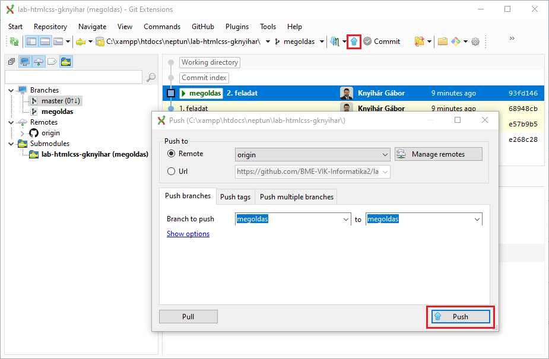

    **Parancssorban**

    ```bash
    git push --set-upstream origin <branch> # első alkalommal, amikor még nem létezik a távoli

    git push # minden további alkalommal
    ```

1. Ellenőrizzük, hogy szinkronban van-e a lokális és a távoli branch.
    - A lokális és a távoli branch ugyanarra a commitra mutat.
    - Nincs nem kommitált változtatás.

    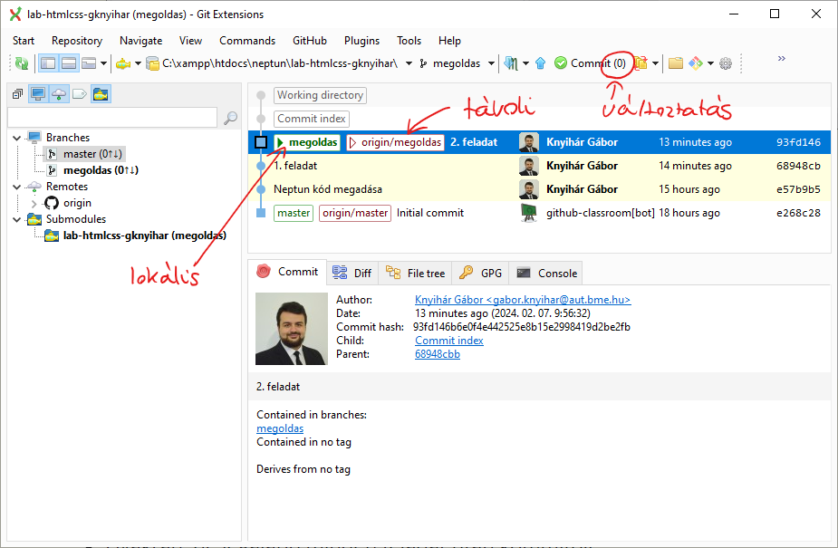

    **Parancssorban**

    ```bash
    git status
    ```

## Megoldások beadása (pull request)

Miután feltöltöttünk mindent, még nem vagyunk készen. Még be kell adni a módosításokat amihez egy pull requestet kell létrehozni.

1. Keressük fel a repository oldalát a GitHub-on.

1. Hozzunk létre egy pull requestet.
    - Ha nem rég pusholtunk, akkor a GitHub fel is ajánla, hogy létrehozhatjuk a pull requestet.
    - Más esetben menjünk a pull request fülre.

    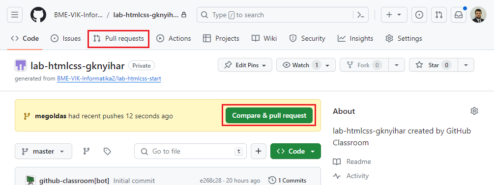

    - Menjünk a `Create pull request` gombra.
    - A `base` legyen a `master`, a `compare` pedig a `megoldas` branch.
  
    !!! note "Megjegyzés"
        A `base` az, ami a kiinduló állapotot tartalmazza, a `compare` pedig az, ami ehhez képest a kiegészítéseket. Ha ezeket felcseréled, akkor például a hozzáadásokat a laborvezető törlésnek, a törléseket pedig hozzáadásnak fogja látni. Ha a folyamat közben valamit másképp csináltál, akkor ennek megfelelően változhat, hogy melyik branchet melyikhez kell kiválasztani.

    - Ellenőrizzük a változtatásainkat, melyek megjelennek lejjebb, majd menjünk a `Create pull request` gombra.

    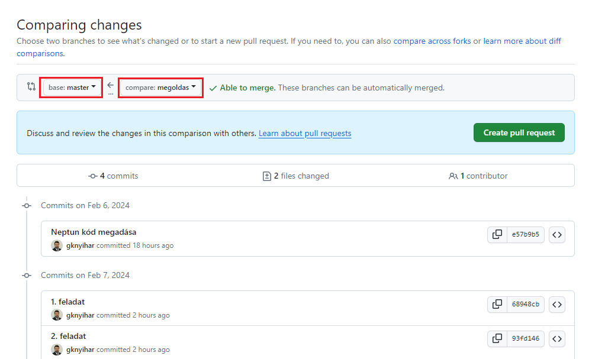

    - Adjunk a pull requestnek rövid, beszédes címet (pl. Lab1 megoldás).
    - Olvassuk át az alapértelmezett leírást, és szükség szerint írjunk hozzá megjegyzést. (A preview fülre kattintva jobban olvasható.)

    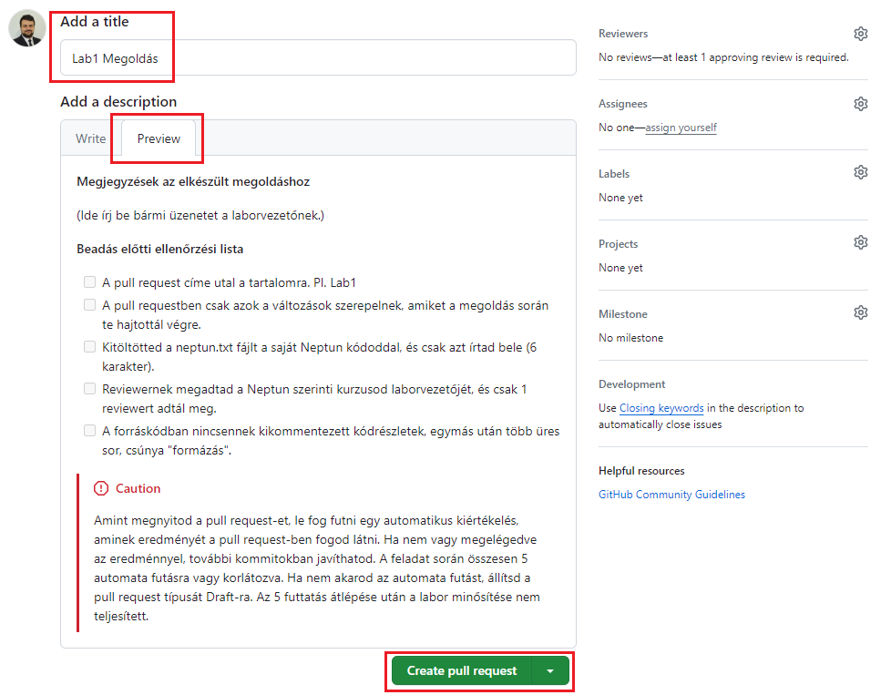

    - Ha minden ok, menjünk a `Create pull request` gombra.

    !!! warning "Fontos"
        Miután megnyitottad a pull requestet, le fog futni egy automatikus kiértékelés:

        - A kiértékelő az alapvető formai követelményeket ellenőrizni (pl. kitöltötted-e a `neptun.txt`-t).
        - Kigyűjti a képernyőképeket, amiket egy komment formájában fog posztolni. 
        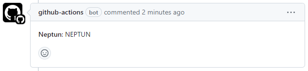
        - Ha nem vagy elégedett az eredménnyel, akkor további kommitokkal tudod javítani. 
        - Minden egyes alkalommal, amikor pusholsz a branchre, ismét le fog futni az értékelés. Ha ezt nem szeretnéd, állítsd a pull requestet `Draft`-ra.
        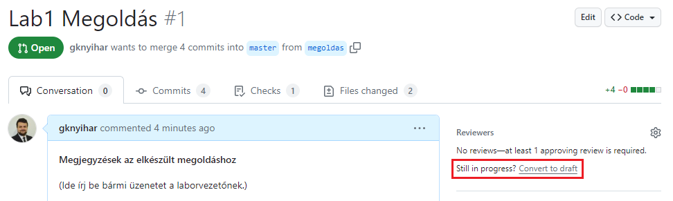
        - Ha elégedett vagy a végeredménnyel, és szeretnéd ismét lefuttatni az ellenőrzőt, állítsd a pull request állapotát vissza.
        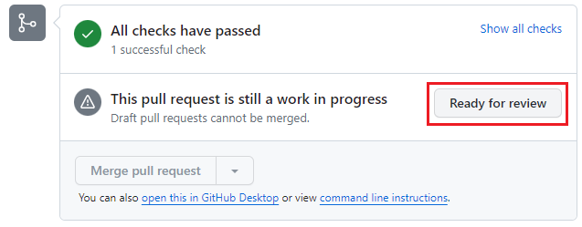
        - **Maximum 5 alkalommal** futtathatod a kiértékelést, utána nem fogadjuk el a beadott megoldást. Ez amiatt van, mert az erőforrások végesek, és ha túlterheled az ellenőrzőt, akkor elképzelhető, hogy másoknak már nem jut szabad erőforrás. Az értékelések számát az **Actions** fülön lehet legkönnyebben leolvasni. Itt azok a futtatások számítanak, amik ténylegesen lefutottak és a státuszuk nem `Skipped`.
        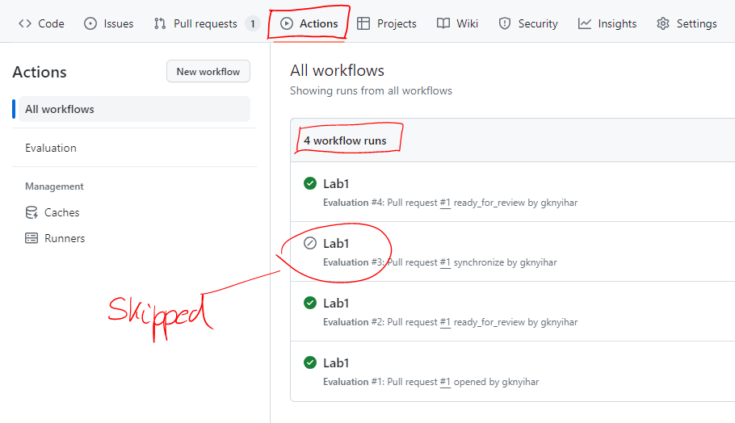

1. Ellenőrizzük a pull request tartalmát.

    - A **Conversation** fülön látjuk az automatikus kiértékelő futásának eredményét és később a laborvezető visszajelzését.
    - A **Commits** fülön látjuk a saját commitjainkat. Abban az esetben, ha a git kliensünk rosszul van konfigurálva, itt a saját nevünk helyett akár másét is láthatjuk.
    - A **Checks** fülön az automatikus kiértékelésekről kaphatunk több információt.
    - A **Files changed** fülön a változtatásokat látjuk, ami alapján a laborvezető értékelni fogja a munkánkat. Ha itt nem látsz mindent módosítást, akkor valamit elrontottál.

1. További munka hozzáadása.

    - Abban az esetben ha valamilyen hibát tapasztaltál, vagy nem vagy elégedett a végeredménnyel, akkor további módosításokat tudsz még hozzáadni.
    - Nem szükséges a pull request törlése, vagy lezárása!
    - További commitok hozzáadása és pusholása után a változtatások automatikusan megjelennek a pull requestben.
    - Figyelj rá, hogy minden pusholáskor le fog futni a kiértékelés ha nem állítod a pull requestet piszkozat (draft) állapotúra.

1. Végül ha mindennel elégedett vagy, rendeld hozzá a pull requestet a laborvezetődhöz.

    - A beadás akkor véglegesedik, ha a laborvezető hozzá van rendelve.
    - A reviewers fülön válasszuk ki a megfelelő laborvezetőt.
        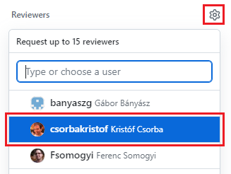

1. Bizonyosodjunk meg róla, hogy a pull request állapota `Open`.

    - Ha minden rendben van, akkor készen vagyunk.

        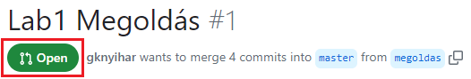

## Ha a laborvezető további módosításokat kérne

Előfordulhat olyan eset, hogy a laborvezető csak feltételekkel fogadja el a megoldást és további módosításokat kér. Erről email-ben kapsz értesítést, vagy a **Conversation** fülön is látható.

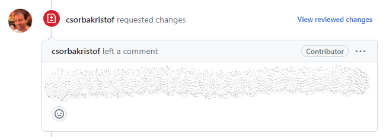

Ebben az esetben ugyanúgy kell eljárni, mint a korábbi lépéseknél:

- Nem szükséges a pull request törlése, vagy lezárása!
- További commitok hozzáadása és pusholása után a változtatások automatikusan megjelennek a pull requestben.
- Figyeljünk az automatikus ellenőrzésre!

Ha készen vagy, menj a `Re-request review` gombra, amivel értesíted a laborvezetőt.

<figure markdown>
  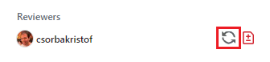
</figure>

## Értékelés utáni kérdés vagy reklamáció

Ha a feladatok értékelésével vagy az eredménnyel kapcsolatban van kérdésed, használd a pull request kommentelési lehetőségét erre. Annak érdekében, hogy a laborvezető biztosan értesüljön a kérdésedről, használd a `@név` megemlítési funkciót a **laborvezető** megnevezéséhez. Erről automatikusan kapni fog egy email értesítést.

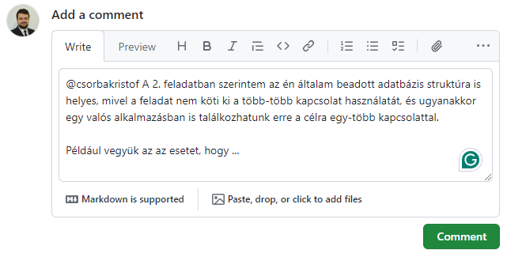

!!! note "Reklamáció csak indoklással"
    Ha nem értesz egyet az értékeléssel, a bizonyítás téged terhel, azaz alá kell támasztanod a reklamációt (pl. annak leírásával, hogyan tesztelted a megoldást, és mi bizonyítja a helyességét).

## Mit lehet tenni, ha valamit elrontottál?

És végül még egy fontos dolog: mi van, ha valamit elrontasz a folyamatban?

- Ha rosszul adtad meg a GitHub nevedet a meghívó URL elfogadásakor, akkor nem fogsz hozzáférni a repository-dhoz. Ebben az esetben az [ahk.aut.bme.hu/my](https://ahk.aut.bme.hu/my) oldalon tudod javítani az elgépelést, majd ezután megkapod a megfelelő hozzáférést.

- Ha még nem hoztad létre a pull requestet, akkor senki nem is látta, hogy valami félrement, kezdd nyugodtan újra az egészet, akár onnan, hogy egy új branchre még egyszer feltöltöd a labor megoldásodat. Lehet, hogy ott marad ekkor egy régi, fel nem használt branch, de ez senkit nem zavar.

- Ha már létrehoztad a pull requestet, de még nem jött el a leadási határidő, így a laborvezetőd nemigen látta, nyugodtan zárd le (esetleg írd oda kommentbe vagy az elején lévő szövegbe, hogy ez nem a végleges és ne vegyük figyelembe).

- Ha a forráskód szintjén maradt le valami, esetleg valamit utólag javítasz, akkor ha a pull request ágára (a fenti példában a “labor” ágra) kommitolsz a pull request létrehozása után, a módosítás automatikusan bekerül a pull requestbe is. Igaz, a laborvezetőd látni fogja az időbeli különbséget, így a határidő utáni módosítást is észre fogja venni, de a határidő előtt nyugodtan utólag is “hozzá lehet még csapni” pár módosítást, nem kell új pull requestet létrehozni.

- És ami még egy kavarodási forrás: mi van akkor, ha elfelejtettél új branchet létrehozni és a masterre kommitoltad a megoldást? Általános szabály, hogy a pull request két ág különbsége. Vagyis ilyen esetben létrehozhatsz egy új branchet a labor megoldása előtti commitra (ahova eredetileg a masternek kellett volna mutatnia), és a pull requestben akkor megfordulnak a szerepek: a master lesz a megoldást tartalmazó és ez az új ág a “base”, vagyis a kiindulási alap. Gondolj arra, hogy a commitok gráfja a lényeg és az ágak csak egy-egy commitra mutatnak. Új ágakkal bármikor bárhova mutathatsz, bármelyiket bárhova áthelyezheted (reset művelet). Commitot elveszíteni igencsak nehéz, az ágakat pedig át lehet helyezni, így elég nagy kavarodásokat is viszonylag könnyen rendbe lehet rakni. Ami fontos, hogy mindig a commit gráfot nézd és abban gondolkodj!

- Előfordulhat olyan is, hogy a masterre kommitoltál és nem tudsz pusholni. Ez azért van, mert egyes beállításoktól függően lehet, hogy a master védett, és nem enged közvetlenül pusholni. Ez egy jó indikátor arra, hogy valamit elrontottál. Ilyenkor több lehetőséged is van:

  - Létrehozol egy új branchet az utolsó commithoz és azt az új branchet pusholod. Ilyenkor a masteren lévő extra commitok nem zavarnak be, mivel ezek csak a saját gépeden léteznek. Ha zavar akkor akár egy `git reset` parancs futtatásával ezeket törölheted is (de csak óvatosan, mivel ezzel a művelettel commitokat örökre elveszíthetsz!).

  - Másik lehetőség, ha nem tudsz új branchet létrehozni (mivel például már adott egy másik amin dolgoznod kéne), akkor egyszerűen állj át arra a branchre amin dolgoznod kellene, majd pedig az egyes commitokat másold át a cherry-pick funkcióval (Jobb klikk a commitra, majd `Cherry-pick this commit` majd `OK`).

- Ha megakadsz, kérj segítséget bizalommal!
