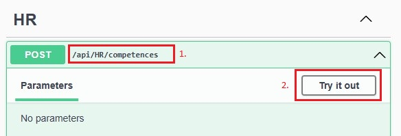
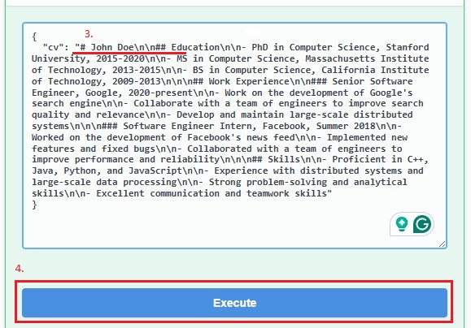

# FullStack Labor

A labor során önállóan fogsz elkészíteni egy LLM-et használó, full-stack alkalmazást. A labor célja, hogy tapasztalatot szerezz a full-stack környezetben történő fejlesztésről, illetve gyakorold a prompt írást.

## Előkészületek

A feladatok megoldásához az alábbi telepített szoftverekre van szükség (alternatívaként használhatod a [BME Cloud](https://cloud.bme.hu/) egyik virtuális gépét):

- [Visual Studio](https://visualstudio.microsoft.com/vs/community/)
    - `ASP.NET and web development` workload
    - `.NET 8.0 Runtime` és `.NET SDK`
- [Node.js](https://nodejs.org/en/download/prebuilt-installer)
- [Git](https://git-scm.com/)

A feladatok megoldása során ne felejtsd el követni a feladatbeadás folyamatát, amiről [itt olvashatsz részletesen](../../tudnivalok/github/GitHub.md).

### Git repository létrehozása és letöltése

1. A Moodle-ben keresd meg a laborhoz tartozó meghívó URL-t, és annak segítségével hozd létre a saját repository-dat.
2. Várd meg, míg elkészül a repository, majd **klónozd le**.
3. Hozz létre egy új ágat `megoldas` néven, és ezen az ágon dolgozz.
4. A `neptun.txt` fájlba írd bele a Neptun-kódodat. A fájlban semmi más ne szerepeljen, csak egyetlen sorban a Neptun-kód 6 karaktere.

### API-kulcs beszerzése

A feladat elkészítése során a [Mistral AI](https://mistral.ai/)-t fogjuk használni. Ennek a szolgáltatásnak van ingyenes csomagja, amellyel API-hozzáférést is kapunk, így tökéletesen használható tapasztalatszerzésre.

* Regisztrálj a [https://v2.auth.mistral.ai/login](https://v2.auth.mistral.ai/login) oldalon.
* Hozz létre egy szervezetet az oldalon tetszőleges névvel. Ez alá fognak majd bekerülni a saját projektjeid.
* Válassz ki egy csomagot: menj a [Subscription](https://admin.mistral.ai/plateforme/subscription) oldalra, kattints a **Compare plans** gombra, és válaszd az **Experiment** csomagot. A választás megerősítéséhez add meg a telefonszámodat, amire egy megerősítő kódot fogsz kapni.

!!! warning "Limitáció"
    Az **Experiment** csomag ingyenes hozzáférést ad a Mistral AI API-jához, viszont számolni kell limitekkel. A legtöbb modell esetében ez percenként 500 ezer token és havonta 1 milliárd token, továbbá másodpercenként csak 1 kérést engedélyez. Ez bőven elegendő lesz a labor megoldásához. Nem valószínű, hogy meg tudod közelíteni ezt a limitet, ugyanakkor célszerű szem előtt tartani, és nem túl bőkezűen bánni vele. További fontos dolog, hogy a csomag használatával hozzájárulsz ahhoz, hogy a promptokat tanítási célra felhasználják, így érdemes kerülni a személyes vagy nem publikus információk megadását.

A csomag létrehozása után nincs más teendő, mint létrehozni az API-kulcsot, ami hozzáférést biztosít majd az API-hoz.

* Menj az [API Keys](https://admin.mistral.ai/organization/api-keys) menüpontra, és kattints a **Create new key** gombra a jobb felső sarokban.
* Adj meg egy nevet a kulcsnak (pl. `FullStackLabor`), és válassz egy tetszőleges lejárati dátumot.
* Másold ki az API-kulcsot, és mentsd el egy biztonságos helyre, mivel később nem lesz alkalmad újra megnézni.

### Projektek elindítása

A solution két projektből áll:
    
- **Server**: a full-stack alkalmazáshoz tartozó backend. A [http://localhost:5130/](http://localhost:5130/) címen érhető el. Az API leírását a [/swagger/index.html](http://localhost:5130/swagger/index.html) címen érheted el.
- **Client**: a full-stack alkalmazáshoz tartozó React frontend. A [http://localhost:5173/](http://localhost:5173/) címen érhető el.

A `Server` projekt már tartalmaz egy `launchSettings.json` fájlt, ami a futtatáshoz szükséges paramétereket tartalmazza. Az elindításhoz ezért a `Server` projektet kell kiválasztanod, ami automatikusan el fogja indítani a `Client` projektet is:

<figure markdown>
{ style="margin:0 auto" }
<figcaption>A Server projekt van kiválasztva, és a http profilt használjuk a futtatáshoz</figcaption>
</figure>


Ha a Start gomb mellett véletlenül nem a `http` feliratot látnád, akkor mellette a legördülő menüből **válaszd** ki azt.

<figure markdown>
{ style="margin:0 auto" }
<figcaption>A profilt a gomb lenyitásával lehet változtatni</figcaption>
</figure>

## Az elkészítendő alkalmazás

A labor során egy olyan, LLM-et használó full-stack alkalmazást kell önállóan elkészítened, amely a munkaerő-toborzással kapcsolatos egyes feladatokat könnyíti meg. Az alkalmazásban nincs szükség authentikációra, adatbázisra vagy perzisztenciára. Az alkalmazás **állapotmentes**. A készülő HR-asszisztens célja, hogy támogassa a HR-munkatársakat a beérkező jelentkezések feldolgozásában. A Markdown formátumban megküldött önéletrajzok alapján a szoftvernek képesnek kell lennie a következő feladatokra:

- A jelentkező kulcs kompetenciáinak kigyűjtése,
- Azoknak a pozícióknak a meghatározása, amelyekre a jelentkező alkalmas lehet,
- A jelentkező legfontosabb adatainak táblázatba rendezése,
- Lehetséges interjú kérdések generálása,
- Automatikus levél generálása interjúra történő behíváshoz.

## 0. feladat

Az alkalmazás funkcióinak teszteléséhez elengedhetetlen egy Markdown-formátumú önéletrajz. Az első feladat során ezt kell létrehoznod, hogy a későbbiekben fel tudd használni. Az önéletrajz mindenképp tartalmazza a jelentkező nevét és egyéb fontos adatait, a tanulmányainak és korábbi munkatapasztalatainak bemutatását, valamint főbb készségeit. Az adatok tetszőlegesen megadhatók, formailag azonban mindenképp kövesse az önéletrajzok főbb szempontjait. A Markdown formátumról [ezen a linken](https://www.markdownguide.org/basic-syntax/) tudsz részletesebben olvasni, továbbá rendelkezésedre áll a kiinduló kliens *Editor* felülete is, ahol meg tudsz szerkeszteni egy ilyen önéletrajzot.

!!! warning "Figyelem"
    Bár adódik a lehetőség, hogy elkészítsd a saját önéletrajzodat itt, ez mégsem ajánlott. A Mistral AI gyűjti a promptokat és felhasználja későbbi tanításokra, így kerüld a személyes adatok megadását! Lehetőleg egy fiktív személy önéletrajzát add meg.

Itt láthatsz egy példa önéletrajzot, hogy egyszerűbb legyen elképzelni, milyen jellegűt kell neked is készíteni:

```markdown
# John Doe

## Education

- PhD in Computer Science, Stanford University, 2015-2020
- MS in Computer Science, Massachusetts Institute of Technology, 2013-2015
- BS in Computer Science, California Institute of Technology, 2009-2013

## Work Experience

### Senior Software Engineer, Google, 2020-present

- Work on the development of Google's search engine
- Collaborate with a team of engineers to improve search quality and relevance
- Develop and maintain large-scale distributed systems

### Software Engineer Intern, Facebook, Summer 2018

- Worked on the development of Facebook's news feed
- Implemented new features and fixed bugs
- Collaborated with a team of engineers to improve performance and reliability

## Skills

- Proficient in C++, Java, Python, and JavaScript
- Experience with distributed systems and large-scale data processing
- Strong problem-solving and analytical skills
- Excellent communication and teamwork skills
```

!!! info "Tipp"
    A `Client/src/App.tsx` fájlban megadható egy alapértelmezett önéletrajz, amivel **egyszerűsíthető** a tesztelés, mivel nem kell kitöltened a mezőt minden egyes indításkor. Ebben az esetben ne felejtsd el a **sortöréseket** `\n\n`-ekre cserélni a stringben.

### Beadandó

!!! example "0. feladat beadandó"
    Készíts egy képernyőképet az elkészült önéletrajzról a kliens *Editor* felületén, majd **`f0.png`** néven másold a repository gyökerébe! Amennyiben az önéletrajzot bemásoltad az `App.tsx` fájlba, akkor **commitold** is a változtatásokat.

## 1. feladat

Az első feladatban biztosítsd a szerver számára az AI-modellel való kommunikáció alapjait.

Tanulmányozd a Mistral AI [API-dokumentációját](https://docs.mistral.ai/api/#tag/chat/operation/chat_completion_v1_chat_completions_post). Itt láthatod, hogy a szerver milyen formátumú kérést vár, és az egyes kérésekre milyen formátumú választ fog adni. Fontos, hogy ezt a formátumot kötelező betartani. Ha a szerver nem így kapja a kérést, akkor nem fog tudni válaszolni (ezt általában egy *422 Unprocessable Content* státuszkódú válasz jelzi).

### Model osztályok létrehozása

Első lépésként hozd létre a kérés és a válasz leírásához szükséges modelleket, amelyek példányait sorosítva megkapjuk az előző lépésben vizsgált JSON-objektumokat.

1. Hozz létre egy `ModelRequest.cs` osztályt a **Server** projekt **Models** mappájában (jobb klikk a mappán, majd *Add* > *Class*).

2. Másold ki a JSON-t a dokumentációból, töröld ki az alapértelmezetten létrejövő osztályt a fájlban (a *namespace*-t ne!), majd **Edit** > **Paste Special** > **Paste JSON as Classes**.

3. Az eszköz automatikusan beszúrja a szükséges osztályokat, ugyanakkor érdemes kissé módosítani őket, hogy csak a számunkra lényeges attribútumokat tartalmazzák.

    1. Nevezd át a `Rootobject` osztályt `ModelRequest`-re.
    2. Töröld ki a számunkra nem szükséges, opcionális property-ket és osztályokat. Csak a `model`, `max_tokens`, `messages` property-k maradjanak, illetve a `Message` osztályon kívül minden más törölhető.
    3. Nevezd át a property-ket `snake_case`-ről `PascalCase`-re, hogy kövessük a C# elnevezési konvencióit.
    4. Cseréld le a **tömböket** `IEnumerable` típusra.
    5. Állíts be alapértelmezett értéket a property-knek: a `Model` legyen `mistral-small-latest`, a `MaxTokens` pedig `250`. Így ezeket nem kell minden alkalommal megadni.
    
        !!! note "Tipp"
            Bátran kísérletezz különböző modellekkel és tokenmennyiséggel! A tokenek száma befolyásolja a válasz hosszát (a beküldött tokenek is beleszámítanak).

    6. Az alábbi modelleket fogod kapni:

        ```csharp
        namespace Server.Models
        {
            public class ModelRequest
            {
                public string Model { get; set; } = "mistral-small-latest";
                public int MaxTokens { get; set; } = 250;
                public IEnumerable<Message> Messages { get; set; }
            }

            public class Message
            {
                public string Role { get; set; }
                public string Content { get; set; }
            }
        }
        ```

4. Egészítsd ki a `ModelRequest` osztályt egy statikus `Generate` metódussal, ami paraméterként vár egy `string` típusú `task` és `cv` változót, és ez alapján létrehozza a megfelelő objektum(oka)t.

    1. A `task` változó fogja tartalmazni szövegesen azt az utasítást, amit a modellnek szánunk, a `cv` pedig az önéletrajzot. Ebben az esetben a feladat a **system** prompt, az önéletrajz pedig a **user** prompt.
    2. A prompt típusát a `Message` osztály `Role` property-je határozza meg.

        ```csharp
        public static ModelRequest Generate(string task, string cv)
        {
            var prompt = new ModelRequest()
            {
                Messages = new[]
                {
                    new Message() {Role = "system", Content = task},
                    new Message() {Role = "user", Content = cv}
                }
            };
            return prompt;
        }
        ```

    !!! info "Prompt típusok, szerepkörök"
        A szerepkörök a LLM-ek kommunikációjának alapvető elemei, amelyek segítenek a beszélgetés kontextusának és résztvevőinek elkülönítésében:

        * A **System** adja meg az alap kontextust és szabályokat, ezt a modell minden esetben figyelembe veszi,
        * A **User** képviseli a felhasználó kérését,
        * Az **Assistant** a modell saját válaszát tartalmazza.

        Ezek együtt biztosítják a konzisztens, irányított és érthető kommunikációt a rendszer és a felhasználó között.

5. Hozd létre a `ModelResponse.cs` osztályt is a korábbiakhoz hasonlóan a modell válaszának leírásához. Ebben az esetben is törölhetők a felesleges property-k, számunkra csak a `choices` és az azon belüli `message` releváns. A `message` property-hez újrahasznosíthatod a korábbi `Message` osztályt.

    ```csharp
    namespace Server.Models
    {
        public class ModelResponse
        {
            public IEnumerable<Choice> Choices { get; set; }
        }

        public class Choice
        {
            public Message Message { get; set; }
        }
    }
    ```

### Szolgáltatás létrehozása

Hozz létre egy service interface-t és az ezt megvalósító service osztályt. A service valósítsa meg a megfelelő HTTP-kérést, amelynek segítségével tetszőleges prompt küldhető az AI-modell felé.

1. Hozz létre egy új mappát a `Server` projektben `Services` néven.

2. A `Services` mappához adj hozzá egy új `IHRService` interface-t (jobb klikk a mappán, *Add* > *New Item* > *Interface*).

3. Az interface-nek legyen egy `Post` metódusa, ami egy `ModelRequest` objektumot vár, és visszatérésként egy `ModelResponse` objektumot ad. A metódus aszinkron, emiatt a visszatérési értéket be kell csomagolni egy `Task` objektumba.

    ```csharp
    using Server.Models;

    namespace Server.Services
    {
        public interface IHRService
        {
            public Task<ModelResponse> Post(ModelRequest request);
        }
    }
    ```

4. Hozd létre az `IHRService` interface-t implementáló `HRService` osztályt a `Services` mappán belül.

    1. Az osztálynak legyen 3 privát, csak olvasható tagváltozója:

        1. `string` típusú `_apiKey`, ami az API-kulcsot,
        2. `Uri` típusú `_baseUri`, ami az API elérési útját,
        3. és egy `JsonSerializerOptions` típusú `_options`, ami a sorosítóhoz szükséges beállításokat tartalmazza.

        ```csharp
        using System.Text;
        using System.Text.Json;

        namespace Server.Services
        {
            public class HRService : IHRService
            {
                private readonly string _apiKey;
                private readonly Uri _baseUri;
                private readonly JsonSerializerOptions _options;
            }
        }
        ```

    2. A konstruktor várni fog egy `IConfiguration` típusú `configuration` objektumot, ami ezeket a beállításokat tartalmazza.

        1. A beállításoknak értéket az `appsettings.json` fájlban tudsz adni. Az `<api-key>` helyére másold be a [korábban](#api-kulcs-beszerzese) létrehozott API-kulcsot.

            ```json
            {
                "Logging": {...},
                "AllowedHosts": "*",
                "Services": {
                    "Mistral": {
                        "Url": "https://api.mistral.ai",
                        "APIKey": "<api-key>"
                    }
                }
            }
            ```

            !!! warning "App settings"
                Az `appsettings.json` fájlt az `appsettings.example.json` fájl alapján tudod létrehozni. Figyelj rá, hogy ezt a fájlt semmiképpen se commitold, mivel a saját API kulcsod is kikerülhet vele a kezed közül.

        2. A beállítások értékeit a `configuration["Services:Mistral:Url"]` és `configuration["Services:Mistral:APIKey"]` sorokkal tudod kiolvasni. Null érték esetén az értékük legyen üres string.

        3. Az `_options` egy olyan `JsonSerializerOptions` objektum legyen, ahol a `PropertyNamingPolicy` az `SnakeCaseLower`. Ez biztosítja, hogy a modell *PascalCase* formátumú property-eit a JSON-ben *snake_case* formátumúra alakítsa.

        ```csharp
        public HRService(IConfiguration configuration)
        {
            _baseUri = new Uri(configuration["Services:Mistral:Url"] ?? "");
            _apiKey = configuration["Services:Mistral:APIKey"] ?? "";
            _options = new JsonSerializerOptions { PropertyNamingPolicy = JsonNamingPolicy.SnakeCaseLower };
        }
        ```

    3. Implementáld az interface `Post` metódusát.

        1. A kérést egy `HttpClient` típusú `client` objektum segítségével tudjuk elküldeni. Ezt az objektumot egy `using` blokkon belül szokás használni.
        2. A kliensnek be kell állítani az authentikációhoz az `Authorization` fejlécet `Bearer <api-key>` formátumban, továbbá az `Accept` fejlécet `application/json` értékre, hogy a szerver tudja, válaszként egy JSON-t várunk.
        3. A kérés objektumot sorosítani kell, ehhez használd a korábban létrehozott `_options` változót, továbbá a kapott szöveget be kell csomagolni egy `StringContent` objektumba.
        4. A kérést a kliens `PostAsync` metódusával tudod elküldeni a dokumentációban szereplő `/v1/chat/completions` útvonalra.
        5. Sikeres teljesítés után, szövegesen kiolvassuk a válasz tartalmát, és a kapott JSON-t objektummá alakítjuk.

        ```csharp
        public async Task<ModelResponse> Post(ModelRequest request)
        {
            using (var client = new HttpClient())
            {
                client.DefaultRequestHeaders.Authorization = new AuthenticationHeaderValue("Bearer", _apiKey);
                client.DefaultRequestHeaders.Accept.Add(new MediaTypeWithQualityHeaderValue("application/json"));

                var promptJson = JsonSerializer.Serialize(request, _options);
                using var content = new StringContent(promptJson, Encoding.UTF8, "application/json");

                using var response = await client.PostAsync(new Uri(_baseUri, "/v1/chat/completions"), content);

                response.EnsureSuccessStatusCode();
                var responseContent = await response.Content.ReadAsStringAsync();
                var result = JsonSerializer.Deserialize<ModelResponse>(responseContent, _options);

                return result;
            }
        }
        ```

    4. A feladat végén az elkészült service-t regisztráld a DI (Dependency Injection) konténerbe. Így később el fogjuk tudni érni az alkalmazás más részein. Szolgáltatásokat regisztrálni a `Program.cs` fájlban tudunk.

    ```csharp
    namespace Server
    {
        public class Program
        {
            public static void Main(string[] args)
            {
                // ...

                // TODO: Add services to the container.
                builder.Services.AddScoped<IHRService, HRService>();

                // ...
            }
        }
    }
    ```

### Beadandó

!!! example "1. feladat beadandó"
    **Commitold** a változtatásokat, különös tekintettel az alábbiakra:

    * Service interface és az azt implementáló service osztály
    * Modell osztály(ok)

## 2. feladat

Ebben a feladatban a kliens és a szerver közötti kommunikáció **szerveroldali** részét kell biztosítanod. Egészítsd ki az előkészített controller osztályt úgy, hogy az az előző feladatban létrehozott service-t használja. Az egyes végpontoknak a HR-asszisztens által biztosított funkciókat kell megvalósítaniuk.

### A szolgáltatás integrálása controllerbe

A controller osztály `HRController` néven már elő van készítve a `Controllers` mappában. Ez tartalmazza minden egyes végponthoz a megfelelő metódust. A metódusok mindegyike úgy van kialakítva, hogy kap egy `HRRequest` objektumot, amelyben a frontendről származó önéletrajz utazik a `Cv` property-ben. A metódusoknak válaszként egy `HRResponse` objektumot kell visszaadni, amelybe a választ a `Text` property-be csomagoljuk. Minden egyes metódusban ugyanazt kell végrehajtanod, csak a paraméterezés (vagyis a feladat leírása a promptban) változik.

1. A korábbi feladatban elkészült és regisztrált szolgáltatás használatához a controllerben is jelezni kell, hogy használni szeretnénk.

    1. Ehhez vedd fel a controller konstruktorának paraméterei közé az interface-t.
    2. Ezután hozz létre egy privát, csak olvasható tagváltozót ezzel a típussal, és az értékét állítsd be a paraméterrel.

    ```csharp
    private readonly IHRService _service;
    public HRController(IHRService service, ILogger<HRController> logger)
    {
        _service = service;
        // ...
    }
    ```

    !!! note "Inversion of Control (IoC)"
        Látható, hogy a service-t a controller osztályban kizárólag az interface-en keresztül érjük el. Ez azért előnyös, mert így a konkrét implementációt könnyen lecserélhetjük, ha a jövőben más módon szeretnénk megvalósítani. Ezen felül sehol nem kell átadni a konkrét példányt a controllernek, mivel ezt a DI-konténer automatikusan megteszi, elősegítve a cserélhetőséget. Ezt az elvet **Inversion of Controlnak** nevezzük.

2. Hozz létre egy újrahasználható, privát, aszinkron `GetResponse` metódust a controllerben, aminek segítségével tetszőleges prompt küldhető a service felé.

    1. A metódus paraméterként kapjon egy `string` típusú prompt szöveget és a `HRRequest` típusú kérést. Visszatérési értékként hozzon létre egy `HRResponse` példányt.
    2. A paraméterek alapján állítsd össze a kérést a service felé, és küldd el.
    3. A service válasza alapján pedig alkosd meg a válasz üzenetet. Hiba esetén a válasz legyen `No response`.

    ```csharp
    private async Task<HRResponse> GetResponse(string task, HRRequest request)
    {
        var prompt = ModelRequest.Generate(task, request.Cv);

        var response = await _service.Post(prompt);
        if (response == null) 
            return new HRResponse { Text = "No response" };

        return new HRResponse
        {
            Text = response.Choices.First().Message.Content
        };
    }
    ```

    !!! info "Megjegyzés"
        Ezt a logikát akár közvetlenül is írhattuk volna az egyes metódusokba, de a kiszervezés által csökkentettük a kód duplikációt, és a kód karbantarthatóbb lett.

3. A controller osztály metódusaiban hívd meg a létrehozott segédfüggvényt.

    ```csharp
    [...]
    public async Task<HRResponse> AskFor...([FromBody] HRRequest request)
    {
        var task = "...";
        return await GetResponse(task, request);
    }
    ```

### A feladatok megoldásához szükséges promptok megírása

Ebben a részfeladatban kell megírnod azokat a promptokat, amelyeket a szolgáltatásnak küldesz feladatként. Az alábbi felsorolás tartalmazza, hogy a szerver mely API-végpontjai milyen funkciókat valósítsanak meg:

* `/api/HR/competences`: A kérésben kapott CV alapján listázza a jelentkező kulcskompetenciáit. A válasz egy 3–5 pontból álló felsorolás legyen Markdown formátumban.
* `/api/HR/positions`: A kérésben kapott CV alapján határozza meg, hogy a jelentkező milyen pozíciók betöltésére lehet alkalmas.
* `/api/HR/data`: A kérésben kapott CV alapján gyűjtse táblázatba a jelentkező legfontosabb adatait. A válasz egy Markdown-ban meghatározott, kitöltött táblázat legyen.
* `/api/HR/questions`: A kérésben kapott CV alapján fogalmazzon meg lehetséges kérdéseket, amelyeket érdemes lehet feltenni az állásinterjú során.
* `/api/HR/invitation`: Generáljon meghívólevelet a kérésben kapott CV „tulajdonosa” részére, ami alkalmas egy interjúra történő behívásra.

Néhány tanács a promptok megírásához:

* A prompt és az önéletrajz **nyelve lehetőleg egyezzen meg**. Ha magyarul írtad a CV-t, akkor a prompt is legyen magyar. Ugyanakkor sok esetben **szerencsésebb az angol nyelv**, ilyenkor a legtöbb modell jobb eredményt ad (ez különösen igaz a kisebb modellekre).
* A promptban **adj kontextust**: mi a modell általános feladata, mit szeretnél viszontlátni.
* Légy **specifikus**: milyen formátumú bemenetet kap, és milyen formátumú kimenetet vársz.
* Légy **kreatív**, kísérletezz: mikor adja a modell a legjobb eredményt.
* Az egyes promptokat a metódusok `task` változójába írd.

Az első feladathoz itt egy példa-prompt, ami az elvártaknak megfelelő megoldást adja.

!!! note ""
    You are an HR assistant. You are provided a CV in markdown format. Collect the key informations of the CV and summarize it in 3 to 5 short bullet points. Output only the bullet points, and use markdown formatting. Do not use code blocks, or any other formatting.

Ezt az alábbi formátumban tudod megadni a metódus törzsében:

```csharp
[HttpPost("competences", Name = "AskForKeyCompetences")]
[ProducesResponseType(typeof(HRResponse), StatusCodes.Status200OK, "application/json")]
[ProducesResponseType(StatusCodes.Status400BadRequest)]
public async Task<HRResponse> AskForKeyCompetences([FromBody] HRRequest request)
{
    var task = "You are an HR assistant. " +
        "You are provided a CV in markdown format. " +
        "Collect the key informations of the CV and summarize it in 3 to 5 short bullet points. " +
        "Output only the bullet points, and use markdown formatting. " +
        "Do not use code blocks, or any other formatting.";
    return await GetResponse(task, request);
}
```

1. Kísérletezz a promptokkal, és írj mindegyik feladathoz egy promptot.
2. A projekt elindítása után a backend `Swagger` felületén keresztül ki tudod próbálni a megoldásaidat.

    1. Válaszd ki az egyik végpontot, nyisd le a felületen, és kattints a `Try it out` gombra.

        <figure markdown>
        
        </figure>

    2. A JSON megfelelő helyére másold be a korábban megírt önéletrajzot, majd kattints az `Execute` gombra.

        <figure markdown>
        
        </figure>

    3. A válasz lentebb fog megjelenni.

        <figure markdown>
        
        </figure>

### Beadandó

!!! example "2. feladat beadandó"
    **Commitold** a változtatásokat, különös tekintettel az alábbiakra:

    * A Controller osztály kódja
    * A megvalósított promptok

    Képernyőképekkel alátámasztva demonstráld a Controller osztály helyes működését:

    * A Server API egyes végpontjait meghívva kapott eredmények (Swagger segítségével kipróbálva).
    * Minden végponthoz készíts külön képernyőképet.

    A készített képernyőképeket másold **`f2-1.png`** – **`f2-5.png`** néven a repository gyökerébe!

## 3. feladat

Az alkalmazás megvalósításának utolsó lépéseként a kliens és a szerver közötti kommunikáció **kliensoldali** részét kell biztosítanod. Tedd működővé az egyes funkciókat az előző feladatban létrehozott API-hívások segítségével. Ehhez egészítsd ki a kliens service osztályát a megfelelő HTTP-kérésekkel. A kliens esetében nagyon hasonló dolgokat kell megvalósítani, mint a szervernél, ugyanakkor itt már számos dolog előre el van készítve. A működéshez kizárólag a service osztályt kell megvalósítani.

1. Keresd meg a `Client` projektben a `src/services/HRService.ts` fájlt.

    1. A service osztály rendelkezik a `get*` **függvényekkel**, amelyek paraméterként megkapják az önéletrajzot a `cv` paraméterben, és egy `string`-et adnak vissza, ami közvetlenül megjelenik a felhasználói felületen.

2. Hozz létre egy közös, újrahasználható metódust a hálózati kommunikáció lebonyolításához.

    1. A metódus legyen privát, aszinkron. Paraméterként kapja a CV-t és az elérési utat, visszatérési értéke pedig szöveg.
    2. A [Fetch API](https://developer.mozilla.org/en-US/docs/Web/API/Fetch_API) segítségével küldd el a kérést a backend felé JSON formátumban.
    3. Hiba esetén egy üres szöveget adjon vissza.
    4. Siker esetén a válasz üzenetet adja vissza. Ne feledd: a válasz JSON-ben jön, ezt fel kell dolgozni.

    ```typescript
    private async _post(path: string, body: string): Promise<string> {

        const url = new URL(path, window.location.href);

        const response = await fetch(url, {
            method: 'POST',
            headers: {
                'Content-Type': 'application/json',
                'Accept': 'application/json',
            },
            body: JSON.stringify({ cv: body }),
        });

        if (!response.ok) {
            console.error(`Request failed (${response.status})`);
            return "";
        }

        return (await response.json()).text;
    }
    ```

    !!! warning "CORS hiba"
        Figyeld meg, hogy a kérést közvetlenül a saját hostra (`window.location.href`) küldjük el. Ennek oka, hogy ha ide a backend címét írnánk a porttal együtt, akkor Cross-Origin Resource Sharing (CORS) hibát kapnánk, mivel a kérés forrása és a célja külön hostra mutat. Ennek elkerülésére a kliensben be van állítva egy átirányítás, ami automatikusan átirányítja az `/api/...` kéréseket a backendre.

3. Ezután csak meg kell hívni minden egyes metódusban a megfelelő paraméterekkel a függvényt. Például:

    ```typescript
    public async getCompetences(cv: string): Promise<string> {
        return await this._post('/api/HR/competences', cv);
    }
    ```

    !!! info "Megjegyzés"
        Figyeld meg, hogy itt is nagyon hasonló logika alapján rakjuk össze a kérést, mint amit a backendnél implementáltunk. A fő különbség, hogy a backend és a frontend között a **kommunikáció** jóval egyszerűbb, mint a külső AI-szolgáltatás esetén.

4. Próbáld ki a funkciókat!

### Beadandó

!!! example "3. feladat beadandó"
    **Commitold** a változtatásokat, különös tekintettel az alábbiakra:

    * Kliens Service osztálya

    Képernyőképekkel alátámasztva demonstráld a kliens Service osztályának helyes működését:

    * Kliens *Overview* oldala az eredményekkel
    * Kliens *Interview* oldala az eredményekkel

    A készített képernyőképeket másold **`f3-1.png`** és **`f3-2.png`** néven a repository gyökerébe!

## Opcionális feladat

Megfigyelheted, hogy az alkalmazás működése során a válasz egy lépésben érkezik: miután ráklikkelsz a gombra, kicsit vársz, majd megjelenik a teljes válasz. Ez eltér attól a viselkedéstől, amit egy LLM-mel történő kommunikáció során gyakran tapasztalunk: sok modellnél a válasz darabokban (például szavanként) érkezik. Így egy hosszabb válasz esetén sem kell sokat várni, már elkezdheted olvasni, és mire a végére érsz, a modell be is fejezi a választ. Ennek a logikának a megvalósítása a feladat.

!!! danger "Fontos"
    Mielőtt ennek a feladatnak nekikezdesz, mindenképp commitolj! Így, ha módosítasz vagy törölsz valamit, akkor is lesz nyoma, hogyan csináltad korábban. De a legjobb, ha az opcionális feladatot újabb kódok hozzáadásával oldod meg, és nem a meglévő felülírásával.

!!! warning "Segédeszközök"
    Ez egy nehéz feladat, ha korábban nem foglalkoztál mélyen webfejlesztéssel, vagy nincs elegendő tapasztalatod ASP.NET-tel vagy TypeScript-tel. Emiatt ne tántorodj el, ha elsőre nem tudod, hogyan kellene megoldani a feladatot. A legfontosabb információkat itt összefoglaljuk neked, de ezen felül **bátran használj AI-eszközöket** (pl. Copilot, ChatGPT …stb.), ezzel is gyakorlod az LLM-ek használatát. Fontos ugyanakkor, hogy **kritikusan** próbáld megoldani a feladatot: **ne elégedj meg az első megoldással**, próbáld meg megérteni, miért úgy kell megoldani, és **csak azt fogadd el, amit értesz** is. Törekedj az egyszerű, átlátható megoldásra, amit te is **el tudnál magyarázni** egy csoporttársadnak. Ha élsz ezzel a lehetőséggel, **mindenképp csatolj promptnaplót** a megoldásod mellé, hogy ellenőrizni tudjuk a gondolatmenetet.

### Streamelés hálózati kommunikációban

A streamelés lehetővé teszi, hogy az adatok folyamatosan, kisebb részekben (*chunk-okban*) érkezzenek a klienshez anélkül, hogy meg kellene várni a teljes válasz összeállítását. Ez különösen hasznos valós idejű alkalmazásoknál, például chat, élő frissítések vagy AI-modellek válaszainak megjelenítésénél. A technológia **Server-Sent Events (SSE)** néven ismert, és a HTTP-kérésben a `Content-Type: text/event-stream` jelöli. A technológiát egyirányú (kiszolgáló → kliens irányú), valós idejű adatküldésre  tervezték. A kapcsolat nyitva marad, és a szerver eseményeket küld folyamatosan, amíg a kliens vagy a szerver le nem zárja.

Egy üzenet sorokból áll, és mindig üres sor zárja le. A JSON formátuma szolgáltatásfüggő, a streamet pedig a `[DONE]` üzenet zárja le. A legtöbb esetben az alábbi formátumhoz hasonló módon jönnek az üzenetek:

```
data: { "message": "chunk 1" }

data: { "message": "chunk 2" }

data: [DONE]
```

A Mistral AI esetében a dokumentációban olvasható, hogy a kérés törzsében a `stream` paraméter `true`-ra állításával lehet bekapcsolni a streamelést. Ilyenkor a kapott válasz részletekben (jellemzően szavanként) érkezik. Figyelj rá, hogy a JSON formátuma kis mértékben eltérő lesz! Erről sajnos nincs példa a dokumentációban, de teszteléssel ezt is meg lehet kapni.

### Megoldás menete

A feladat megoldását az alábbi lépések megvalósításával érdemes végigvinni.

1. **Backend** logika megvalósítása.
    1. Hozd létre a módosított model osztályokat.
    2. A service interface-ben és osztályban hozz létre egy új `PostStream` metódust, és implementáld.
        1. A metódus nagyon hasonlóan működik a korábbi `Post` metódushoz.
        2. Fontos különbség, hogy a visszatérési értéke `IAsyncEnumerable`, erről részletesebben olvashatsz [ezen a linken](https://learn.microsoft.com/en-us/archive/msdn-magazine/2019/november/csharp-iterating-with-async-enumerables-in-csharp-8).
        3. Ne felejtsd el az `Accept` fejléc értékét `text/event-stream`-re állítani.
        4. Ebben az esetben nem használhatod a `PostAsync` metódust, helyette `SendAsync` kell, amihez manuálisan kell összeállítani a kérést. Így be tudod állítani, hogy a `completionOption` `ResponseHeaderRead` legyen. Erre azért van szükség, mert így a fejléc megérkezése után azonnal elkezdődik a válasz feldolgozása, és nem vár a teljes tartalomra.
    3. Hozz létre egy új controller-t `StreamHRController` néven, amelynek `/api/StreamHR/...` végpontjai lesznek.
        1. A promptok és minden más ugyanaz, viszont a választ itt is `text/event-stream` formában kell továbbküldeni a kliensnek.
        2. A saját SSE-kommunikációd megvalósításához használhatod a `Response.WriteAsync(...)`, `Response.Body.FlushAsync(...)` és `Response.CompleteAsync()` függvényeket.
2. **Frontend** logika megvalósítása.
    1. Hasonlóan a korábbiakhoz, egészítsd ki a `HRService.ts` osztályt.
        1. Készítsd el a `getCompetencesStream(...)` stb. metódusokat, amelyek egy közös `_postStream(...)` metódust hívnak.
        2. A `_postStream` metódus visszatérése legyen `AsyncGenerator`.
        3. A megvalósításhoz használhatod az [sse.js](https://www.npmjs.com/package/sse.js?activeTab=readme) és a [@borewit/async-queue](https://www.npmjs.com/package/@borewit/async-queue) *npm* csomagokat, de ezek nélkül is megoldható
            
            !!! note "NPM csomagok"
                A csomagok telepítéséhez használd a `npm install <package-name>` parancsot a `Client` könyvtárban.

        4. A `Module` frontend komponens fel van készítve a stream megjelenítésére. Rendelkezésre áll egy `streamGetter` attribútum a `getter` mellett. Ha ennek értékét megadjuk, automatikusan ezt fogja használni. Például az `Interview.tsx` komponensben, ha létrehozol egy `getInvitationStream()` függvényt, és átadod a megfelelő `Module` komponens `streamGetter` attribútumának, már az fog meghívódni.

### Beadandó

!!! example "Opcionális feladat beadandó (10 pont)"
    **Commitold** a változtatásokat, különös tekintettel az alábbiakra:

    * Server Service
    * Server Controller
    * Kliens Service
    * Kliens oldalak

    Egy-egy képernyőképpel alátámasztva demonstráld az alábbiakat:

    * Készíts egy-egy képernyőképet a kliens oldalról, ahol az egyik válasznak még csak egy része érkezett meg, illetve amikor már az egész megérkezett.

    A készített képernyőképeket másold **`fo-1.png`** és **`fo-2.png`** néven a repository gyökerébe!

    Ezen felül, amennyiben használtál valamilyen AI-eszközt a feladat megoldásához, mellékelj **promptnaplót**:

    * A napló tartalmazza szöveges formátumban a feltett kérdéseket és az arra kapott válaszokat,
    * Szerepeljen benne az is, hogy melyik modellt kérdezted, és mikor (dátum elég, időpont nem kell),
    * A promptnaplót mentsd el a projekt gyökerébe `prompts.log` néven, és **commitold**.
